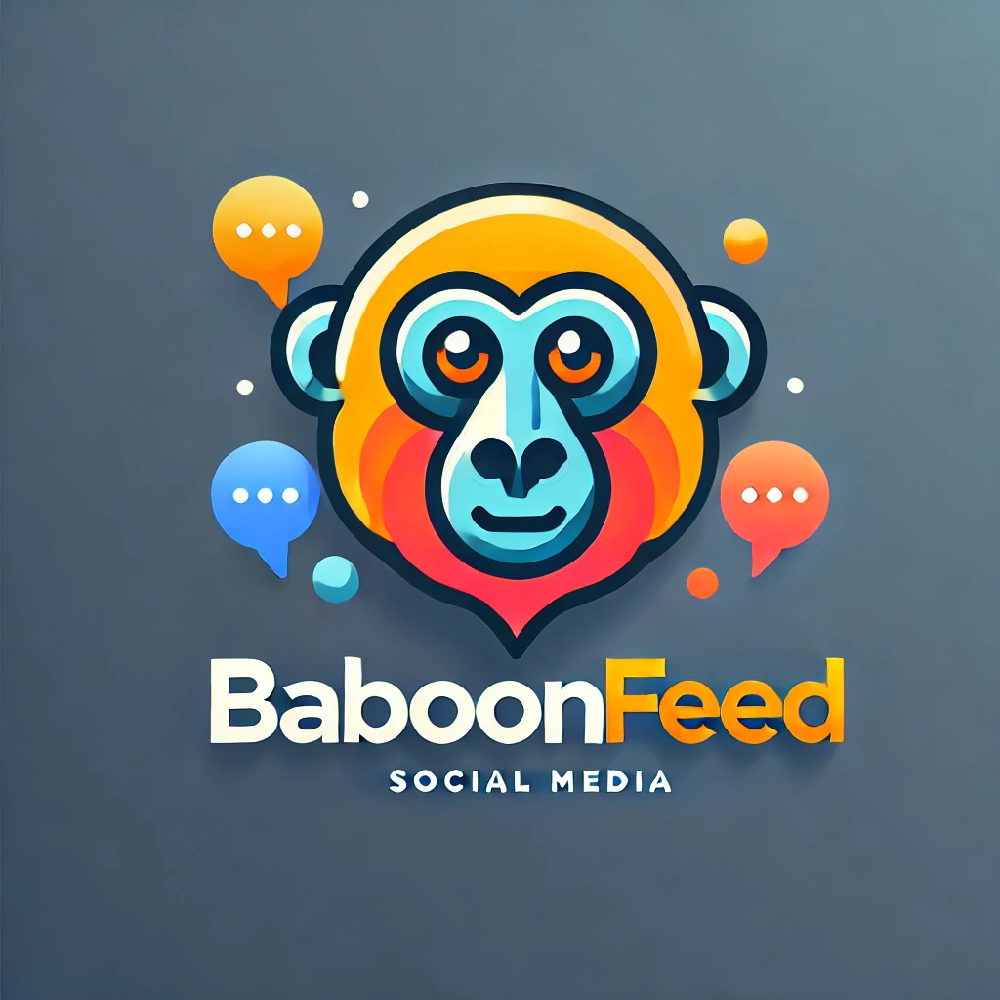

# BaboonFeed



**BaboonFeed** es una red social cuyo objetivo es permitir la libre expresión del humor sin depender de reglas estrictas. Sin embargo, "sin muchas reglas" no significa total libertad: siempre debe tratarse de humor y expresarse desde el respeto. Cualquier comentario que no cumpla con estas normas será eliminado, y el usuario recibirá un aviso.

## Características principales

### Feed interactivo

- BaboonFeed ofrece un feed donde se mostrarán las publicaciones de los usuarios a los que sigues.
- Puedes darle "me gusta" a las publicaciones y comentar en ellas para expresar tu opinión o añadir algo a la conversación.

### Interacción social

- Es posible seguir a otros usuarios para ver sus publicaciones en tu feed.
- Puedes bloquear a usuarios cuyas publicaciones no sean de tu agrado.
- Existe la posibilidad de comentar tanto en publicaciones como en otros comentarios, permitiendo expandir las respuestas y generar debates interesantes.

### Mensajería

- BaboonFeed incluye un sistema de chat que permite:
  - Enviar mensajes privados a otros usuarios.
  - Crear chats grupales para compartir imágenes, videos y audios con varios usuarios.
- En caso de que bloquees a un usuario (o seas bloqueado), seguirás teniendo acceso al historial de mensajes, pero no podrás enviar ni recibir nuevos mensajes de esa persona.

## Seguridad y verificación

Nuestra plataforma cuenta con un sistema de seguridad basado en un registro y verificación por correo electrónico. El proceso es el siguiente:

1. Durante el registro, se genera una clave única para cada usuario.
2. Se envía un correo electrónico al email registrado por el usuario.
3. Este correo contiene un enlace y/o un botón para verificar la cuenta.
4. Una vez que el usuario verifica su correo, podrá acceder a su cuenta mediante un inicio de sesión simple.

---

BaboonFeed es un espacio para compartir humor, respetando siempre a los demás y fomentando la interacción social de manera sana y divertida.

## Paleta de Colores

1. **Primario (`primary`)**: `#f39c12`

   - Naranja vibrante del logo. Úsalo para botones principales, encabezados destacados y elementos que requieran atención.

2. **Secundario (`secondary`)**: `#34495e`

   - Azul oscuro del fondo del logo. Ideal para barras de navegación, fondos secundarios o elementos discretos.

3. **Éxito (`success`)**: `#2ecc71`

   - Un verde complementario (no presente en el logo, pero sugerido para consistencia). Úsalo para mensajes de éxito o acciones positivas.

4. **Peligro (`danger`)**: `#e74c3c`

   - Rojo cálido del logo. Perfecto para mensajes de error, advertencias o acciones destructivas como eliminar contenido.

5. **Información (`info`)**: `#3498db`

   - Azul brillante complementario (puede ser extraído del logo). Útil para mensajes informativos o estados neutros.

6. **Advertencia (`warning`)**: `#f1c40f`

   - Amarillo complementario al naranja. Úsalo para advertencias o alertas importantes.

7. **Fondo (`background`)**: `#ecf0f1`
   - Gris claro. Ideal como fondo para mantener un diseño limpio y minimalista.

---

### CSS/Bootstrap

```css
:root {
  --bs-primary: #f39c12; /* Naranja vibrante */
  --bs-secondary: #34495e; /* Azul oscuro */
  --bs-success: #2ecc71; /* Verde para éxitos */
  --bs-danger: #e74c3c; /* Rojo para errores */
  --bs-warning: #f1c40f; /* Amarillo para advertencias */
  --bs-info: #3498db; /* Azul para información */
  --bs-light: #ecf0f1; /* Gris claro */
  --bs-dark: #2c3e50; /* Azul grisáceo oscuro */
}
```

### Aplicación práctica

- **Botón principal**: `btn-primary` → Color naranja.
- **Botón secundario**: `btn-secondary` → Color azul oscuro.
- **Alertas**: Usa `alert-danger`, `alert-success`, etc., para mensajes relacionados.
- **Fondos**: Usa `--bs-light` o `--bs-dark` para contrastar con los elementos visuales principales.
